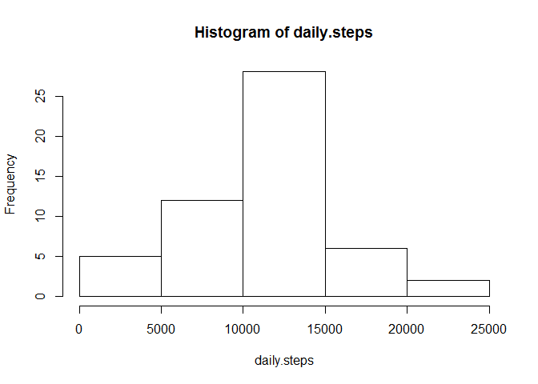
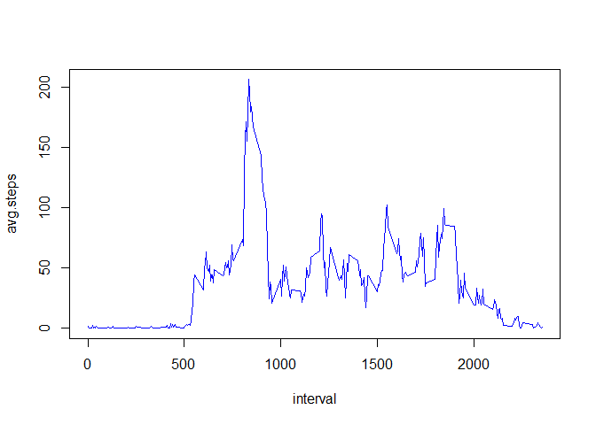
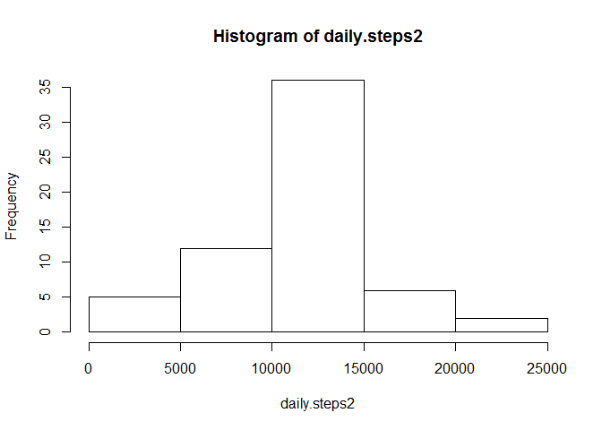
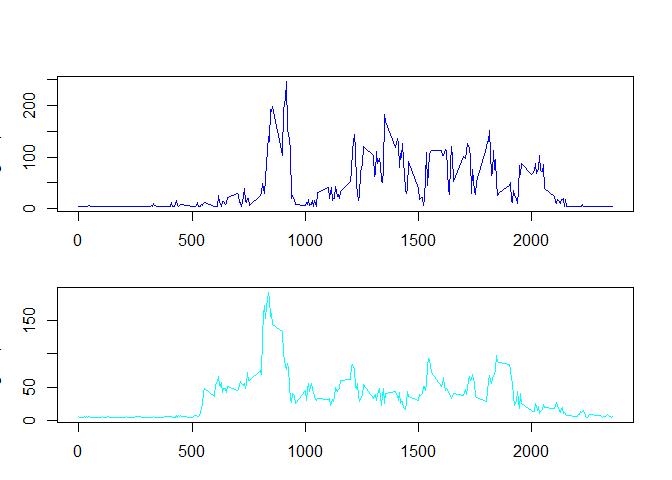

# Reproducible Research: Peer Assessment 1


## Loading and preprocessing the data
First the data file must be unzipped with the *unz* function. Then it is loaded to a variable *data* with the *read.csv* function. We print out the first few lines to get a short overview of the data.

```r
myfile <- unz("activity.zip", "activity.csv")
data <- read.csv(myfile, header=T, quote="\"", sep=",")
head(data)
```

```
##   steps       date interval
## 1    NA 2012-10-01        0
## 2    NA 2012-10-01        5
## 3    NA 2012-10-01       10
## 4    NA 2012-10-01       15
## 5    NA 2012-10-01       20
## 6    NA 2012-10-01       25
```
Some observations contain some *NA* values. These observations should be excluded from further analysis. We create a variable *processed.data* where we store the processed data. We produce a logical vector of all complete observations of the original data with the *complete.cases* function.  We apply this logical vector to the original data to get the processed data which contains no *NA* values. As a short verification we print out the first few lines of the processed data with the *head* function.

```r
good <- complete.cases(data)
processed.data <- data[good, ]
head(processed.data)
```

```
##     steps       date interval
## 289     0 2012-10-02        0
## 290     0 2012-10-02        5
## 291     0 2012-10-02       10
## 292     0 2012-10-02       15
## 293     0 2012-10-02       20
## 294     0 2012-10-02       25
```
## What is mean total number of steps taken per day?
First we have to aggregate the steps per day with the *aggregate* function. We save the steps per day in a data frame *steps.per.day* and give it the correct column names.

```r
steps.per.day <- aggregate(processed.data$steps, by=list(processed.data$date), FUN=sum, na.rm=TRUE)
colnames(steps.per.day) <- c("date", "steps")
head(steps.per.day)
```

```
##         date steps
## 1 2012-10-02   126
## 2 2012-10-03 11352
## 3 2012-10-04 12116
## 4 2012-10-05 13294
## 5 2012-10-06 15420
## 6 2012-10-07 11015
```
Then we put the steps variable in a histogram.

```r
daily.steps <- steps.per.day$steps
hist(daily.steps)
```

 
Finally we are ready to evaluate the mean with the *mean* function and the median with the *median* function.

```r
print(mean(daily.steps))
```

```
## [1] 10766.19
```

```r
print(median(daily.steps))
```

```
## [1] 10765
```
We can see that the arithmetic mean of total steps taken per day is 10'766.19 while the median of total steps per day is 10'765.

## What is the average daily activity pattern?
First we aggregate the number of steps by 5-minute interval and average them. We have to assign the correct column names to the new data frame *activity.pattern*.

```r
activity.pattern <- aggregate(processed.data$steps, by=list(processed.data$interval), FUN=mean, na.rm=TRUE)
colnames(activity.pattern) <- c("interval","steps")
head(activity.pattern)
```

```
##   interval     steps
## 1        0 1.7169811
## 2        5 0.3396226
## 3       10 0.1320755
## 4       15 0.1509434
## 5       20 0.0754717
## 6       25 2.0943396
```
Then we plot a time series of the average steps.

```r
interval <- activity.pattern$interval
avg.steps <- activity.pattern$steps
plot(x = interval, y = avg.steps, type = "l", col = "blue")
```

 
  
The maximum number of steps can be found with the *max* function. Subsetting the *activity.pattern* reveals the observation which contains the maximum. It is interval 835.

```r
max.steps <- max(avg.steps)
max.set <- activity.pattern[activity.pattern$steps == max.steps,]
print(max.set$interval)
```

```
## [1] 835
```

## Inputing missing values
The number of missing values can be calculated by using the *is.na* function and summing up the elements of the logical vector it produces. It is 2304.

```r
missing <- is.na(data)
missing.els <- sum(missing)
print(missing.els)
```

```
## [1] 2304
```
As we want to check if we obtain the same results when we include observations with missing values, we need a strategy to replace missing values. We decide to replace *NA* values with the average per day divided by the number of 5-minute intervals per day. Since steps is an integer we round the result to full integer values. The replacement value is 37.

```r
intervals.per.day <- 24 * 60 /5
new.value <- mean(daily.steps)/intervals.per.day
new.value <- round(new.value)
print(new.value)
```

```
## [1] 37
```
Now we fill in the replacement value where NA values are present. We use the *missing* variable for this purpose. Then we verify that all NA values are replaced by printing out the number of missing values and observing that it is 0.

```r
processed.data2 <- data
processed.data2[missing,]$steps <- new.value
print(sum(is.na(processed.data2)))
```

```
## [1] 0
```

```r
head(processed.data2[missing,])
```

```
##   steps       date interval
## 1    37 2012-10-01        0
## 2    37 2012-10-01        5
## 3    37 2012-10-01       10
## 4    37 2012-10-01       15
## 5    37 2012-10-01       20
## 6    37 2012-10-01       25
```
All remaining NA values are removed then.

```r
good <- complete.cases(processed.data2)
processed.data2 <- processed.data2[good,]
```
The calculation of the histogram is the same as described earlier. First we aggregate the sum of steps per day.

```r
steps.per.day2 <- aggregate(processed.data2$steps, by=list(processed.data2$date), FUN=sum, na.rm=TRUE)
colnames(steps.per.day2) <- c("date", "steps")
head(steps.per.day2)
```

```
##         date steps
## 1 2012-10-01 10656
## 2 2012-10-02   126
## 3 2012-10-03 11352
## 4 2012-10-04 12116
## 5 2012-10-05 13294
## 6 2012-10-06 15420
```
Then we plot the histogram

```r
daily.steps2 <- steps.per.day2$steps
hist(daily.steps2)
```

 
And then we print mean and median. The new mean is now 10'751.74 and the median is 10'656. Median and mean are a little bit smaller now.

```r
print(mean(daily.steps2))
```

```
## [1] 10751.74
```

```r
print(median(daily.steps2))
```

```
## [1] 10656
```
We compute the differences of mean and median. The mean is reduced on 14.45097 steps per day and the median is reduced around 109 steps per day.

```r
a1 <- mean(daily.steps)
m1 <- median(daily.steps)
a2 <- mean(daily.steps2)
m2 <- median(daily.steps2)
dif.mean <- a2 - a1
dif.median <- m2 - m1
print(dif.mean)
```

```
## [1] -14.45097
```

```r
print(dif.median)
```

```
## [1] -109
```
## Are there differences in activity patterns between weekdays and weekends?
First we create a new column *weekday*.

```r
processed.data2["weekday"] <- c("Sunday", "Monday", "Tuesday", "Wednesday", "Thursday", 
  "Friday", "Saturday")[as.POSIXlt(processed.data2$date)$wday + 1]
```
Then we capture all sundays and saturdays and assign the value 1 to them.

```r
is.saturday <- (processed.data2$weekday == "Saturday")
processed.data2[is.saturday,]$weekday <- 1
is.sunday <- (processed.data2$weekday == "Sunday")
sundays <- processed.data2[is.sunday,]
sundays$weekday <- 1
```
All remaining days get the value 0.

```r
is.zero <- (processed.data2$weekday != 1)
processed.data2[is.zero,]$weekday <- 0
```
Then we create a factor variable.

```r
processed.data2$weekday <- factor(processed.data2$weekday, labels = c("weekday", "weekend"))
```
Two datasets for weekend and weekdays are created. The proper column names are given and the weekday columns removed again.

```r
weekend <- (processed.data2$weekday == "weekend")
weekday.data <- processed.data2[!weekend,]
colnames(weekday.data) <- c("steps","date","interval","weekday")
weekend.data <- processed.data2[weekend,]
colnames(weekend.data) <- c("steps","date","interval","weekday")
weekday.data <- weekday.data[!(colnames(weekday.data) %in% c("weekday"))]
weekend.data <- weekend.data[!(colnames(weekend.data) %in% c("weekday"))]
```
Then we create two aggregates for weekday and weekend activity patterns.

```r
wd.pattern <- aggregate(as.numeric(weekday.data$steps), by=list(weekday.data$interval), FUN=mean, na.rm=TRUE)
colnames(wd.pattern) <- c("interval","steps")
we.pattern <- aggregate(as.numeric(weekend.data$steps), by=list(weekend.data$interval), FUN=mean, na.rm=TRUE)
colnames(we.pattern) <- c("interval","steps")
```
Then we plot the interval.

```r
interval.we <- we.pattern$interval
avg.steps.we <- we.pattern$steps
interval.wd <- wd.pattern$interval
avg.steps.wd <- wd.pattern$steps
oldpar <- par(mfrow=c(2,1), mar=c(3,3,1,1), oma=c(0,0,3,1))
plot(x = interval.we, y = avg.steps.we, type = "l", col = "blue")
plot(x = interval.wd, y = avg.steps.wd, type = "l", col = "cyan")
```

 

```r
par(oldpar)
```
